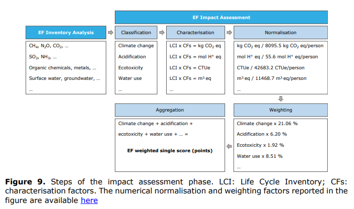
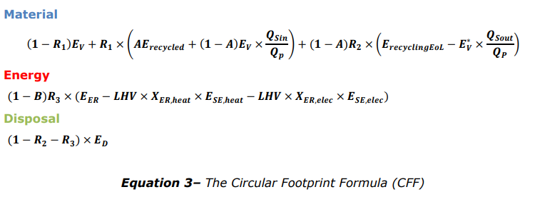

# Notes on manufacturing footprint

# Links

## BCG: ****For Chipmakers, the Decarbonization Challenge Lies Upstream****

[For Chipmakers, the Decarbonization Challenge Lies Upstream](https://www.bcg.com/publications/2023/why-chipmakers-need-to-focus-on-the-upcoming-decarbonization-challenges)

## Dell server footprint analysis

## GaBi LCA database

[Product Sustainability (GaBi) Data Search | Sphera](https://sphera.com/product-sustainability-gabi-data-search/)

## Digital technologies in Europa a Environmental Live Cycle Approach

## ISO 14040 ****Environmental management — Life cycle assessment — Principles and framework****

[https://www.iso.org/standard/37456.html](https://www.iso.org/standard/37456.html)

## Environmental footprint methods

[Environmental Footprint methods](https://green-business.ec.europa.eu/environmental-footprint-methods_en)

- PEF: Product Environmental Footprint
- OEF: Organisation Environmental Footprint
- Refers to [PEF method](Notes-on-manufacturing-footprint.md)
- helping companies to calculate their environmental performance based on reliable, verifiable and comparable information
- It also allows [public administrations, NGOs, business partners, …] to have access to such [environmental performance]
- Refers to [Understanding PEF and OEF methods](Notes-on-manufacturing-footprint.md)

## Understanding PEF and OEF methods

- The Environmental Footprint method builds on ISO 14040 ([ISO 14040 ****Environmental management — Life cycle assessment — Principles and framework****](Notes-on-manufacturing-footprint.md))
- Refers to PEF: [PEF method](Notes-on-manufacturing-footprint.md)
- Refers to OEF: [https://eplca.jrc.ec.europa.eu/permalink/OEF_method.pdf](https://eplca.jrc.ec.europa.eu/permalink/OEF_method.pdf)
- EPLCA: European Platform on Life Cycle Assessment
- On LCA:
    
    > measures aimed at achieving one specific goal (like reducing greenhouse gases) might have negative consequences that were not considered in the first instance […]
    > 
    > 
    > Including all these aspects in the decision-making process to avoid so-called "burden shifting" is the great advantage that the application of life cycle thinking brings to the development of policies, products and services in today's globalised context.
    > 
- 16 impact categories considered 
- **Classification** implies assigning all input and output flows collected in the inventory to the relevant impact categories.
- **Characterisation** is the process to model environmental mechanisms *linking* the *environmental pressures* represented by inventory data (i.e. inputs of resources or emissions associated with the product life cycle) *to each EF impact category*, and to quantify the impact magnitude.
- **Normalisation** is the calculation of the magnitude of the category
indicator results relatively to a reference system.
- **Weighting** is the process of converting normalised results of the different impact categories by using numerical factors *based on the expressed relative importance of the impact categories considered*.
    - Refers to [This mostly documents how to create PEF/OEF data sets, not particularly useful for me.](https://www.notion.so/This-mostly-documents-how-to-create-PEF-OEF-data-sets-not-particularly-useful-for-me-8950e0a3c0f74595af5d0c4810cd150a?pvs=21)

- Refers to PEFCR for IT equipment (the link is incorrect and cannot find it anywhere)

## PEF method

### Notes

- **4.4.2 Electricity use** defines how to account for electricity in various situations, like one product multiple locations.
- **4.4.8.1 The Circular Footprint Formula.** How to compute the footprint of a product
    
    
    
    <aside>
    💡 This needs more in-depth study
    
    </aside>
    

CFF aids are in the Annex C download here:  [https://eplca.jrc.ec.europa.eu/LCDN/developerEF.xhtml](https://eplca.jrc.ec.europa.eu/LCDN/developerEF.xhtml)

### Classification

Classification requires assigning the material/ energy inputs and outputs inventoried in the LCI to the relevant EF impact category.

### Characterization

Characterisation refers to the calculation of the magnitude of the contribution of each classified input and output to their respective EF impact categories, and aggregation of the contributions within each category.

**The characterisation factors** [WY: CFs in image above] **are substance- or resource-specific.**

Charecterization factors are defined in this excel sheet: [https://eplca.jrc.ec.europa.eu/permalink/EF3_1/EF-LCIAMethod_CF(EF-v3.1).xlsx](https://eplca.jrc.ec.europa.eu/permalink/EF3_1/EF-LCIAMethod_CF(EF-v3.1).xlsx)

## Environmental footprint (EF) impact assessment

Captured in  

## Development of a weighting approach for the Environmental Footprint

This study defined the **weighting** and **normalization** factors as present in , the study was extensive including experts, and European citizens to define importance.

Updated list for PEF/OEF methods (Excel): 

As of 2023-May-25 this list is not changed from the original document. The numbers have been incorporated in the table of .

## **Global environmental impacts: data sources and methodological choices for calculating normalization factors for LCA**

[Global environmental impacts: data sources and methodological choices for calculating normalization factors for LCA](https://link.springer.com/article/10.1007/s11367-019-01604-y)

## ETSI - Methodology for environmental LCA of ICT
goods, networks and services

## European Chemicals Agency

[Regulation (EC) No 1907/2006 of the European Parliament and ... - EUR-Lex](https://eur-lex.europa.eu/legal-content/EN/LSU/?uri=CELEX:32006R1907)

## EU actions to ensure safe and sustainable chemicals for health and the environment.

[Chemicals](https://environment.ec.europa.eu/topics/chemicals_en)

[REACH Regulation](https://environment.ec.europa.eu/topics/chemicals/reach-regulation_en)

[Chemicals strategy](https://environment.ec.europa.eu/strategy/chemicals-strategy_en)

## Data centre EURECA Project (EURECA)

[Documents download module](https://ec.europa.eu/research/participants/documents/downloadPublic?documentIds=080166e5bb75393b&appId=PPGMS)

(5.5.1 ICT Challenges) But no project so far looked at how to support designers reason about energy efficiency of IT systems at design time. In practice, system Architects do not reason about	 energy efficiency simply because they can’t due to the lack of tools and frameworks (Bashroush, 2016).

# Low importance

## Guide for Environmental Footprint compliant data sets

This mostly documents how to create PEF/OEF data sets, not particularly useful for me.

## European Platform on LCA: Nodes containing EF data

[Nodes containing EF data (last update: April 2023) -](https://eplca.jrc.ec.europa.eu/LCDN/contactListEF.xhtml)

Just a list of links on where to find PEF/OEF data.

## Environmental footprint methods

[Environmental footprint methods](https://environment.ec.europa.eu/news/environmental-footprint-methods-2021-12-16_en)

This looks like some kind of press release.