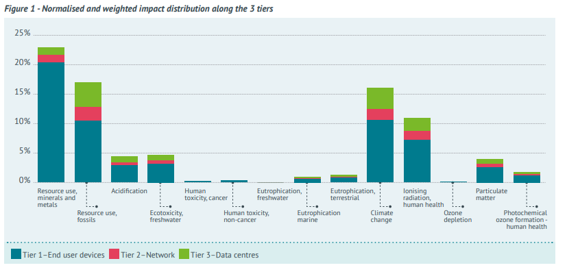

# benqassemDigitalTechnologiesEurope2021

```{bibliography}
:filter: key == "benqassemdigitaltechnologieseurope2021"
```

This report used the [16 environmental impact categories](/computing-footprint/environmental-impact-categories.md) 
identified by the EU to analyze how ICT in the EU affects the global
environment. It is the most thorough study on environmental impact of ICT I
could find, and includes many tables and figures on the impact of various types
of devices and services, including IOT and datacenters, giving a good feel on
how ICT currently impacts the environment.

However, this study does not give any direction when it comes to making
decisions between one type of service or another. For example, although edge
datacenters currently have lower environmental impact than cloud datacenters
does not mean that edge datacenters and a better choice for new solutions when
it comes to environmental impact.

Also, although it gives a lot of detail on types of equipment, it is still
insufficient when you need to decide specific IOT solutions. All in all, a good
report providing a good basis and worth citing. It would be useful to get access
to their [NegaOctet](http://negaoctet.org/en/home) database.

## Key findings

**[Emphasis is mine]**

1. **"Resource use, minerals and metals" is by far the most important
   environmental indicator regarding the environmental impacts of ICT, before
   "Climate change" and "Resource use, fossils".** This means multicriteria
   assessments are key to providing a systemic overview of the environmental
   impacts and avoiding impact transfers
2. **The manufacturing phase is the category with the greatest impact on "resource
   use, minerals and metals"**, and the raw material and waste production
   indicators. **The use phase is the category with the greatest impact on the
   other indicators at the scale of Europe.**
3. The end-user devices are the most impactful, representing between 90% and 54%
   of the impacts, depending on the indicator. This is due to the large number
   of devices in all categories.
4. The TV category alone represents a large proportion of the environmental
   impacts on all the indicators assessed, especially "Resource use, minerals
   and metals" (20%) for environmental indicators and waste production (21.5%)
   for flow indicators.
5. Although the "IoT connected objects" category contains a miscellany of
   devices and configurations, **the rise of the IoT is noticeable, especially
   regarding final energy consumption**.
6. Many device categories, such as desktops, laptops, TV boxes, smartphones,
   printers, desktops game consoles and tablets, are important contributors to
   the environmental impacts of ICT end-user devices.
7. **The datacentre tier contributes between 5% and 23% of the environmental
   impact of ICT according to the environmental indicators**, and accounts for
   between 13% and 28% of the flows.

## Notes

Using the PEFCR method, this report identifies the 8 most relevant impact categories for ICT:
* Climate change
* Particulate matter
* Acidification
* Ionising radiation, human health
* Photochemical ozone formation, human health
* Resource use, fossils
* Resource use, minerals and metals
* Ecotoxicity, freshwater

The categories *water use* and *land use* were excluded for lack of high quality data.

They also idenfity 4 flows: material input per services, waste production,
primary energy, final energy. **I do not yet fully comprehend these flows or
their relevance**

"Lifespan" can mean one of four things:
1. Normative lifetime, as measured under specific test conditions
2. Useful life span, the period during which the product is used
3. Ownership life span, the time between entry (not necessarily new) and exit of the "household"
4. Existence life span: the time between end of manufacturing and disposal

## Snippets

```{list-table} Table 3
:header-rows: 1
:widths: 50 10 10
:stub-columns: 1

* -
  -
  - Percentage of EU-28 boundaries per indicator
* - Resource use, minerals and metals - tonnes
Sb eq.
  - 5,760 
  - 39.3%
* - Resource use, fossils- PJ
  - 3,960 
  - 26.4%
* - Acidification - mol H+ eq. (in billions)
  -  1.19 
  - 1.8%
* - Ecotoxicity, freshwater - CTUe
  -  3,090 
  - 35.2%
* - Climate change - Mt CO₂ eq.
  -  185 
  - 40.7%
* - Ionising radiation, human health - GBq U235 eq.
  -  278 
  - 0.8%
* - Particulate matter - Disease occurrence
  -  8,000 
  - 23.2%
* - Photochemical ozone formation - human health -
tonnes NMVOC eq.
  -  464,000 
  - 1.7%
* - Raw materials - Mt
  -  571
  -
* - Waste production - Mt
  -  116
  -
* - Primary energy consumption - PJ
  -  4,230
  -
* - Final energy consumption (use) - PJ
  -  1,020
  -
```

```{admonition} Wim
So looking at the planetary boundary for climate change, ICT in the EU alone is responsible 
for 40.7% of the EU budget.
```

```{list-table} Table 5
:header-rows: 1
:widths: 50 10 10 10
:stub-columns: 1

* -
  - **Tier 1** 
    
    End user devices
  - **Tier 2** 
    
    Network
  - **Tier 3** 
    
    Data centres
* - Resource use, minerals and metals 
  - 88.8% 
  - 5.9% 
  - 5.3%
* - Resource use, fossils 
  - 62.0% 
  - 14.1% 
  - 23.9%
* - Acidification 
  - 65.8% 
  - 12.1% 
  - 22.1%
* - Ecotoxicity, freshwater 
  - 69.4% 
  - 10.1% 
  - 20.5%
* - Climate change 
  - 65.5% 
  - 11.9% 
  - 22.5%
* - Ionising radiation, human health 
  - 65.5% 
  - 14.4% 
  - 20.2%
* - Particulate matter 
  - 64.0% 
  - 13.0% 
  - 22.9%
* - Photochemical ozone formation - human health 
  - 67.3% 
  - 11.4% 
  - 21.3%
* - Raw materials 
  - 66.7% 
  - 12.2% 
  - 21.2%
* - Waste production 
  - 78.6% 
  - 8.6% 
  - 12.8%
* - Primary energy consumption 
  - 58.2% 
  - 15.6% 
  - 26.2%
* - Final energy consumption (use) 
  - 53.8% 
  - 17.9% 
  - 28.2%
```

```{admonition} Wim
Note that Tier 1 includes IoT sensors and actuators.
```



### IOT

The second most important cause of impacts is the IoT. Although individual
devices have lower impacts, they constitute the category with the most devices,
especially regarding commercial building controls (624,589,079 units estimated)
and smart meters (223,067,528 units estimated). Indeed, commercial building
controls and smart meters represents altogether more than 56% of the IoT devices
and more than 12.1 TWh over the 27.7 TWh consumed by the IoT devices.

### Datacenter

```{admonition} Summary
Cloud datacenters are more efficient than traditional datacenters (lower PUE).
The number of edge datacenters is growing with 5G.
```

[...] computing and storage equipment are responsible for most of the impacts
due to their large number and individual impact. ICT equipment requires a lot of
energy and materials during manufacturing