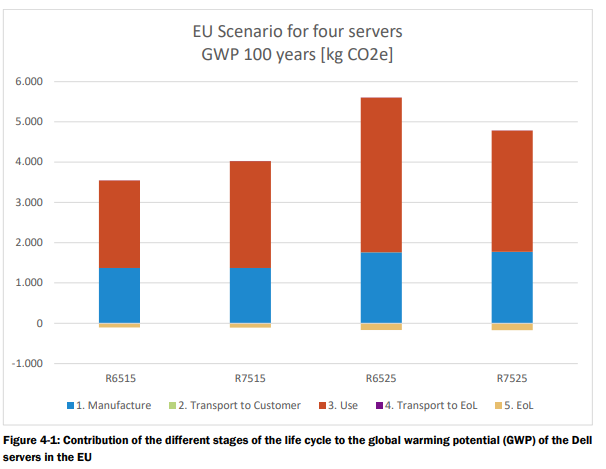

---
jupytext:
  formats: md:myst
  text_representation:
    extension: .md
    format_name: myst
kernelspec:
  display_name: Python 3
  language: python
  name: python3
---
# saraevLCAServersR65152021

```{bibliography}
:filter: key == "saraevlcaserversr65152021"
```

## In-depth exploration

[Exploration of the data](./saraevLCAServersR65152021/analysis)

## Devices under study

Table 2-1.

```{list-table}
* - Component
  - R6515
  - R7515
  - R6525
  - R7525
* - Chassis 
  - 1U Rack Chassis with up to 4x3,5" Hard Drives for 1CPU configuration incl. rails and bezel
  - 2U Rack Chassis with up to 8x3,5" Drives for 1 CPU Configuration incl. rails and bezel
  - 1U Rack Chassis with up to 4x3,5" Drives for 2 CPU Configuration incl. rails and bezel
  - 2U Rack Chassis with up to 8x3,5" Drives for 2CPU Configuration incl. rails and bezel
* - Mainboard
  - 12 layers, OSP finishing
  - 12 layers, OSP finishing
  - 14 Layers 
  - 14 Layers
* - Processor(s)
  - 1x AMD EPYC 7452 
  - 1x AMD EPYC 7452 
  - 2x AMD EPYC 7452 
  - 2x AMD EPYC 7452
* - Processor Thermal configuration
  - 1x Standard Heatsink for CPU
  - 1x Standard Heatsink for CPU
  - 2x Standard Heatsink for CPU
  - 2x Standard Heatsink for CPU
* - DIMMs 
  - 8x Micron 16GB 
  - 8x Micron 16GB 
  - 16x Micron 16GB 
  - 16x Micron 16GB
* - Raid/ Internal Storage Controller
  - Yes 
  - Yes 
  - Yes
  - Yes
* - Hard Drives
  - 2x 4TB SATA 
  - 2x 4TB SATA 
  - 2x 4TB SATA 
  - 2x 4TB SATA
* - PCIe Riser Card 
  - 1x16 LP PCIe 
  - No 
  - 1x16 LP, 2x16 LP 
  - Half Length, 4x8
* - Network Daughter Card
  - Dual Port 
  - Dual Port 
  - Quad Port 
  - Quad Port
* - Fans 
  - 6x Standard Fans 
  - 6x Standard Fans 
  - 6x Standard Fans 
  - 6x Standard Fans
* - Power Supply 
  - 2 PSUs 
  - 2 PSUs 
  - 2 PSUs 
  - 2 PSUs
* - Additional Network Cards:
  - Dual Port 
  - Dual Port
  - No
  - No
* - Packaging 
  - Cardboard boxes and plastic film and foam
  - Cardboard boxes and plastic film and foam
  - Cardboard boxes and plastic film and foam
  - Cardboard boxes and plastic film and foam 
```

## Impact summary

Impact summary for the EU as listed on pages 13 and 14.

```{list-table}
:header-rows: 1

* - Impact category
  - R6515
  - R7515
  - R6525
  - R7525
* - Abiotic Depletion [MJ]
  - 39100
  - 44200
  - 61400
  - 52300
* - Acidification Potential [kg SO2 eq.]
  - 9.91
  - 10.9
  - 14.9
  - 13.2
* - Eutrophication Potential [kg Phosphate eq.]
  - 0.913
  - 1.02
  - 1.4
  - 1.21
* - Ozone Layer Depletion Potential [kg R11 eq.]
  - 3.45E-08
  - 3.31E-08
  - 2.06E-08
  - 2.00E-08
* - Photochemical Ozone Creation Potential [kg Ethene eq.]
  - 0.687
  - 0.754
  - 1.04
  - 0.913
* - Global Warming Potential 100 years excl. biogenic carbon [kg CO2 eq.]
  - 3450
  - 3920
  - 5440
  - 4620
```

```{admonition} Wim
Also Figure 4-1 shows that the contribution to GHG emissions is dominated by
usage over 4 years (~1100 kgCO2e over ~2400kgCO2e for the R6515). According 
to 3.3.1 they used a typical energy mix in the EU-28 to estimate the GHG 
emissions of electricity generation during usage.
```

### From page 42+

The share of Greenhouse gas emissions of the manufacturing stage ranges from 28%
to 39% depending on the scenario and whether a light-medium or a heavy use
scenario in the use stage is considered.

```{code-cell} ipython3
import pandas as pd
from itables import show

show(pd.read_csv("saraevLCAServersR65152021/figure4-3-6.csv"))
```

Looking at the use phase of these servers we see that the 50% load mode uses the
most energy, mostly because the power draw is significant and the time spent in
50% mode is large:

```{code-cell} ipython3
import plotly.express as px

df = pd.read_csv("saraevLCAServersR65152021/table3-13-16.csv", header=[0,1])
df.columns = df.columns.map("{0[0]}({0[1]})".format)

fig = px.bar(df, x="Device(ID)", color="Power draw(W)", y="Energy(kWh/yr)", text="Load(mode)", facet_col="Workload(name)")
fig.show()
```


## Snippets

System boundaries of the study are from cradle-to-grave, accounting for all life
cycle activities from extraction of raw materials and energy sources from the
environment through to disposal and recycling of products at end of life.

The functional unit used in the assessment, which can serve as the basis for
comparisons to similar products, is the provision of computing services capable
of handling very demanding workloads and applications, such as data warehouses,
e-commerce, AI/Machine Learning, and high-performance computing (HPC) for four
years with the following load profile for light-medium and heavy workload
respectively:
* 100% load mode: 10% and 15% of the time
* 50% load mode: 35% and 55% of the time
* 10% load mode: 30% and 20% of the time
* Idle mode: 25% and 10% of the time



The transport to end of life has a minimal contribution [...]

Most of the part production impacts during manufacturing are from the components
containing electronics, which account for only 26% to 31% of the total mass of
the products, and especially the SSDs. The
biggest contribution of the SSDs comes from the NAND flash [...].

```{admonition} Wim
Even Sphera being asked by Dell complain of lack of quality data from the 
manufacturing side, like a bill-of-material.

Also, as per table 2-2, additional air conditioning, network infrastructure, and 
parts re-use was excluded. Especially the air conditioning may have some 
contribution.
```

```{admonition} Wim
Table2-3 (page 20) lists the impact categories used for this study. They were not 
taken from the european selection as specified by PEF, but from a model called CML
2001. **How does this map to the PEF categories?**

The "climate change" PEF category is identical to the "global warming potential" of 
CML.
```

Table 3-9:
| CPU                                    | Substrate (mm x mm) | Die (mm x mm)          | Die area (mm2) (90 % of Chip size) | Tech node | Technology | CPU                                    |
| -------------------------------------- | ------------------- | ---------------------- | ---------------------------------- | --------- | ---------- | -------------------------------------- |
| Family: AMD Opteron Rome AMD EPYC 7452 | 58,5x75,4           | 8 ICs each 11,6 x 8,09 | 675,68                             | 14nm      | CMOS       | Family: AMD Opteron Rome AMD EPYC 7452 |

Table 3-10:

| Electro-mechanic components | Weight (kg) | Pieces (Nr.) |
| --------------------------- | ----------- | ------------ |
| SSD 4TB                     |             | 2            |
| Memory Chip (DRAM)          | 85,42       | 5 (per SSD)  |
| Memory Chip (Flash)         | 257,18      | 8 (per SSD)  |

Table 3-12: Power values used in the Use Phase of the Dell Servers R6515, R7515, R6525, R7525
```{csv-table}
:file: saraevLCAServersR65152021/table3-12.csv
:header-rows: 2
```

Power draw and energy consumption for the servers under heavy and light to
medium workloads. The *duration* indicates how much time was spent in that
particular load mode.

```{code-cell} ipython3
import pandas as pd
from itables import show

show(pd.read_csv("saraevLCAServersR65152021/table3-13-16.csv", header=[0,1]))
```

:::{note}
Tables 3-20 to 3-23 provide LCI results for various flows. 
:::

:::{todo}
Convert Tables 3-20 to 3-23, LCI results for various flows to CSV.
:::

Figure 4-11 shows that the majority of the SSD impact of the 4TB SSDs comes from
the NAND flash. As described in section 3.2.3, several assumptions were made
regarding package dimensions, die/package ratio and die stack per package to
model these chips. The data for these parameters are based on the part number of
the chips and publicly available data from Samsung (Gibb, 2016) (PC Watch,
2016). 

```{note}
Figure 4-11 basically shows that NAND flash in an SSD has ~850 kgCO2e emissions, next 
largest is the PWB (Printed Wiring Board) at ~10 kgCO2e.
```

One memory bar has a GWP of 33 kg C02e and its contribution to total GWP of the
server is significant, [...]

```{note}
Figure 4-12 basically shows that for memory bars PWB is responsible for 98% of the 
emissions, followed by Gold at 2%.
```

```{note}
For the mainboard the distribution is:

| Device       | Component  | Contribution |
| ------------ | ---------- | ------------ |
| R6515, R7515 | PWB        | 57%          |
| R6515, R7515 | CPU        | 28%          |
| R6515, R7515 | Connectors | 15%          |
| R6525, R7525 | PWB        | 48%          |
| R6525, R7525 | CPU        | 29%          |
| R6525, R7525 | Connectors | 23%          |
```

The following characteristics help to explain this impact distribution and are
true for all electronics discussed within this study:
* PWB manufacturing is a multi-step, highly energy intensive process with a
  significant amount of waste production and direct emissions. For Dell’s
  circuit boards, some also require the use of gold which is a precious metal
  with very energy and emission intensive upstream production steps of
  extraction and processing.
* Active components (ICs, diodes and transistors) contain a semiconductor die
  which has a highly energy intensive manufacturing process, increasing in
  direct proportion with the area of the chips. In addition, active components
  often require gold or other precious metals. Therefore, large ICs such as
  memory chips, CPUs, and graphic cards etc., will have a high carbon footprint
  due to the energy demand of the production steps.
* Passive components do not contain a die, but can contain a small amount of
  precious metals. Large and massive passive components can therefore have a
  high contribution to environmental impacts, but small components are generally
  less relevant to the overall impact;
* Connectors can also contain gold and/or other precious metals in small
  amounts. 

```{admonition} Wim
PWB emissions seem to scale with the dimension and number of layers, Same as 
"active component" emissions.
```
