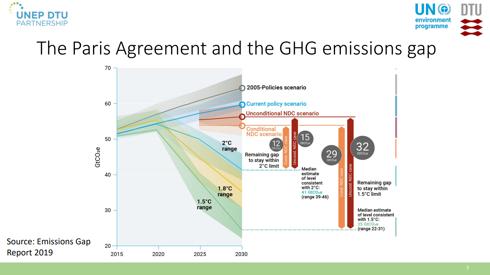
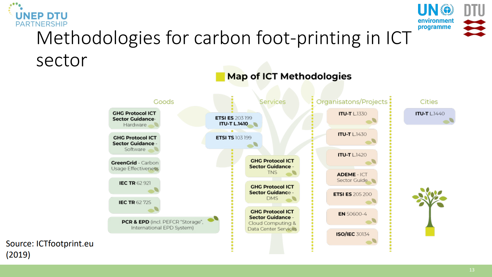

# unepdtuGreenhouseGasEmissions2020

```{bibliography}
:filter: key == "unepdtugreenhousegasemissions2020"
```

References {cite:t}`belkhirAssessingICTGlobal2018`.

This presentation gives a nice overview of the state of ICT GHG emission estimation and prediction in 2020. It is high-profile (UN), and collects data from many sources. **It does not give any actionable figures, but serves as context and background.**

ICT as part of the problem:
* Direct effects: Technology
  * Life-cycle: production, use, disposal
* Enabling effects: Application
  * Induction effects
  * Obsolescence effects
* Systemic effects: Behavioral and structural change
  * Rebound effects
  * Emerging risks

ICT as part of the solution:
* Direct effects: Technology
  * Not applicable by definition
* Enabling effects: Application
  * Substitution effects
  * Optimization effects
* Systemic effects: Behavioral and structural change
  * Transition towards sustainable patterns of production and consumption

Some of these effects require further explanation, but are not given directly by
this source.

Trends in IoT devices: 2016 ~6000M to 2020 estimated at ~20000M devices, the majority for consumers (estimated at ~13000M in 2020).

## Snippets




